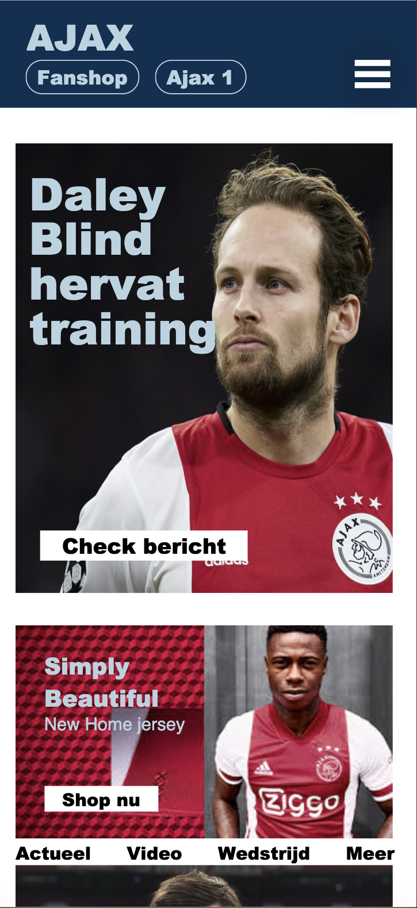
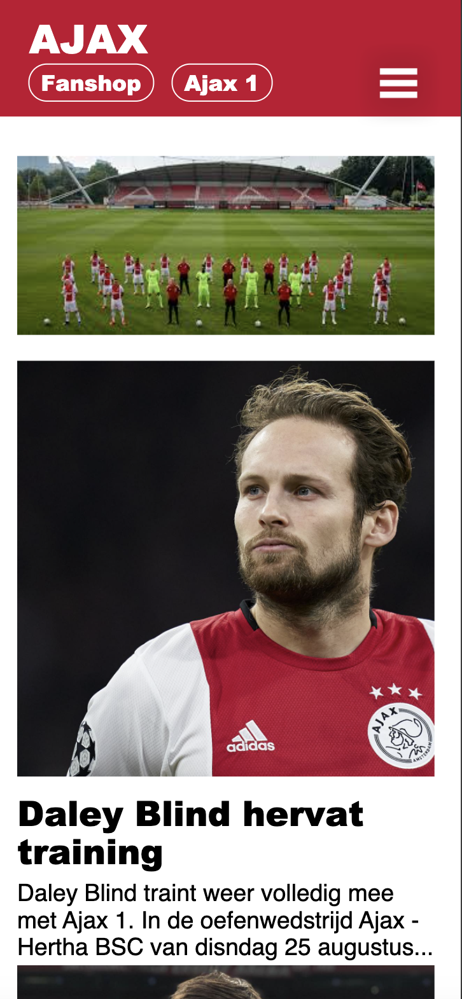
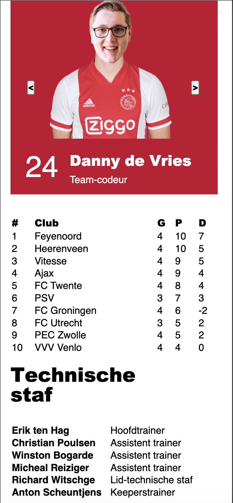
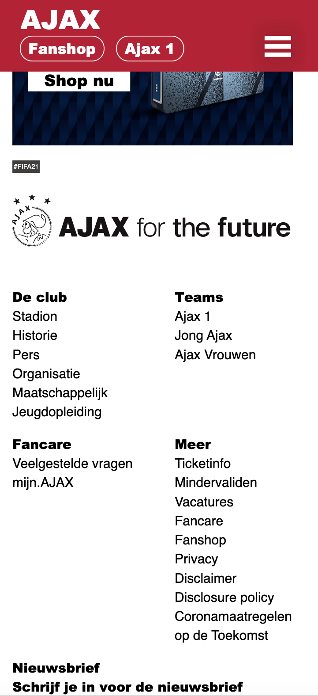
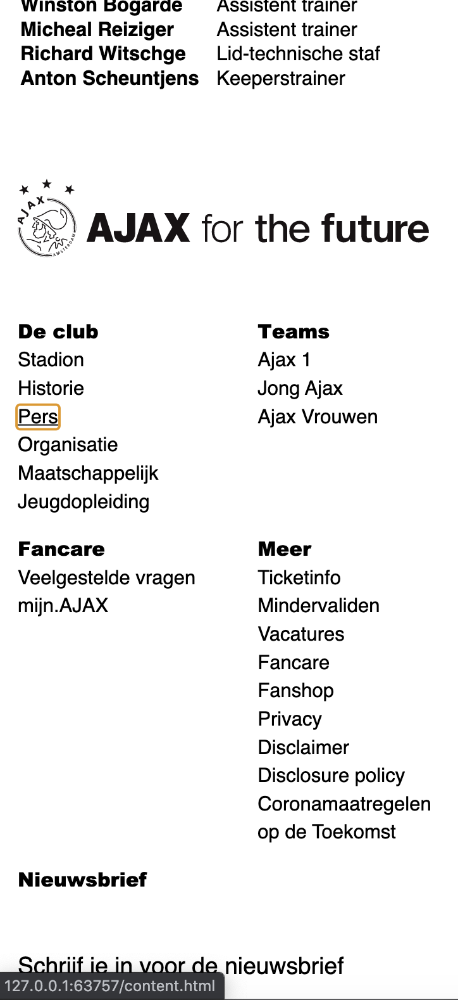

# Procesverslag
**Auteur:** -Dylan Troff-

Markdown cheat cheet: [Hulp bij het schrijven van Markdown](https://github.com/adam-p/markdown-here/wiki/Markdown-Cheatsheet). Nb. de standaardstructuur en de spartaanse opmaak zijn helemaal prima. Het gaat om de inhoud van je procesverslag. Besteedt de tijd voor pracht en praal aan je website.

## Bronnenlijst
1. -https://css-tricks.com-
2. -https://www.w3schools.com-
3. -https://medium.com-
4. -De lessen-

## Eindgesprek (week 7/8)

-dit ging goed & dit was lastig-

**Screenshot(s):**
Hieronder foto's van mijn eindresultaat. Ik heb op het einde nog fade-in animaties toegevoegd die ik met afbeeldingen helaas niet kan laten zien. Ook kan ik door een klik op een knop de huistijl van website aanpassen (foto 2). Dit door een class aan de body toe te voegen. Danny begint te dansen als je over hem hovert en als je met het keyboard op de website bent dan zie je allemaal focus states die de gebruiker helpen de website te begrijpen (laatste foto). 

## Voortgang 3 (week 6)

### Stand van zaken

Wat moet ik nog doen in de vakantie? 
* States toevoegen om de website toegankelijk te maken
* Animaties toevoegen om de website leuker/aangenamer te maken
* Een micro-interactie maken

Als ik naar dit lijstje kijk denk ik dat ik dit moet gaan redden voor het einde. Als micro-interactie wil ik de slider werkend maken of de style van de body aanpassen. Als animatie wil ik een fade-in animatie bij het opstraten van de website en ik wil iets met danny als ajaxspeler doen.

**Screenshot(s):**
Bij voortgang 3 had ik ten opzichte van voortgang 2, 3 nieuwe dingen die ik wou bespreken.
* De slider
* De stand
* Het menu met de staf

De slider zag er op het oog goed uit maar werkte niet. De stand heb ik uiteindelijk opgelost door een tabel te maken en deze te vullen met content. De lijst met de stafleden van Ajax heb ik gemaakt als een UL met Li's erin.

### Agenda voor meeting

Voor de 3e meeting heeft niemand eigenlijk specifieke vragen. We willen gewoon kijken of het goed gaat komen en of we nog wat ideeën kunnen opdoen.

## Voortgang 2 (week 5)
### Stand van zaken
Voor voorgang drie wil ik mij bezighouden met het afmaken van mijn detail pagina. Deze is nog niet af en dit moet echt wel goed gebeuren. Wat er nog nodig is, is het maken van een slider, tabel en een paar lijstjes. De homepagina is af op animatie na.

**Screenshot(s):**
Voor het tweede voortgangs gesprek ben ik bezig geweest met het flexboxen van mijn footer(foto 1). Dit heb ik samen met Danny tijdens de les gedaan. Ook ben ik begonnen met het maken van mijn detailpagina. Dit ziet er tot nu toe zo uit (foto 2)

### Agenda voor meeting
Tijdens het 2e voortgang gesprek willen wij kijken naar:
* Grid en hoe dit werkt
* Nog extra aandacht aan javascript
* En even kijken of we op schema liggen

## Voortgang 1 (week 3)

### Stand van zaken

De opdrachten gingen vaak goed en me gemakkelijk af. Tijdens het maken van de homepage had ik ook weinig moeite. Alleen het plaatsen van mijn hamburger menu was een uitdaging en moest een paar keer opnieuw.

**Screenshot(s):**

Voor het eerste voortgangs gesprek was ik vooral bezig met de huiswerkopdrachten. Tot toen had ik alleen nog mijn home page voor een deel klaar.

### Agenda voor meeting
Tijdens het eerste voortgang gesprek willen wij kijken naar:

* Hoe je een caroussel maakt
* Wat je moet doen om je navigatie goed te positioneren
* En we zouden extra uitleg willen over het resposive maken van de website

### Verslag van meeting

De meeting verliep soepel en we wisten wat we wilde vragen. Ik had zelf geen directe vragen maar de vragen van de andere en de antwoorden daarop hebben mij zeker ook geholpen. 

## Intake (week 1)

Mijn start-niveau zit tussen blauw en rood in

Ik wil mij gaan focussen op het leuker maken van deze site door micro-animaties toe te voegen

Ajax.nl

**Screenshot(s):**

**Breakdown-schets(en):**

