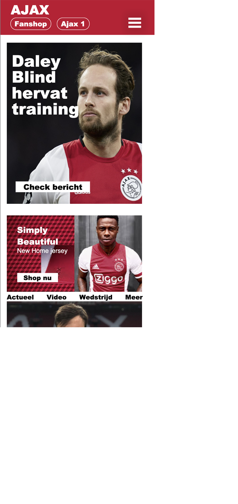

# Procesverslag
**Auteur:** -jouw naam-

Markdown cheat cheet: [Hulp bij het schrijven van Markdown](https://github.com/adam-p/markdown-here/wiki/Markdown-Cheatsheet). Nb. de standaardstructuur en de spartaanse opmaak zijn helemaal prima. Het gaat om de inhoud van je procesverslag. Besteedt de tijd voor pracht en praal aan je website.

## Bronnenlijst
1. -bron 1-
2. -bron 2-
3. -...-

## Eindgesprek (week 7/8)

-dit ging goed & dit was lastig-

**Screenshot(s):**

-screenshot(s) van je eindresultaat-

## Voortgang 3 (week 6)

-same as voortgang 1-

## Voortgang 2 (week 5)
### Agenda voor meeting
Tijdens het 2e voortgang gesprek willen wij kijken naar:
Grid en hoe dit werkt
Nog extra aandacht aan javascript
En even kijken of we op schema liggen

## Voortgang 1 (week 3)

### Stand van zaken

-dit ging goed & dit was lastig-

**Screenshot(s):**

-screenshot(s) van hoe ver je bent-

### Agenda voor meeting
Tijdens het eerste voortgang gesprek willen wij kijken naar:

* Hoe je een caroussel maakt
* Wat je moet doen om je navigatie goed te positioneren
* En we zouden extra uitleg willen over het resposive maken van de website

### Verslag van meeting

De meeting verliep soepel en we wisten wat we wilde vragen. Ik had zelf geen directe vragen maar de vragen van de andere en de antwoorden daarop hebben mij zeker ook geholpen. 

## Intake (week 1)

Mijn start-niveau zit tussen blauw en rood in

Ik wil mij gaan focussen op het leuker maken van deze site door micro-animaties toe te voegen

Ajax.nl

**Screenshot(s):**

**Breakdown-schets(en):**

